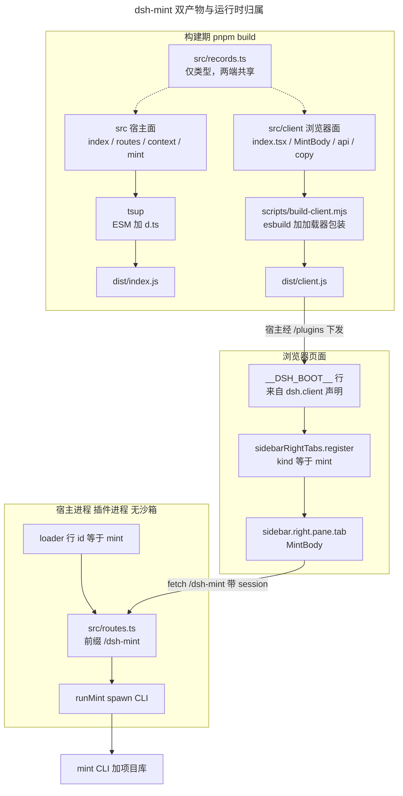
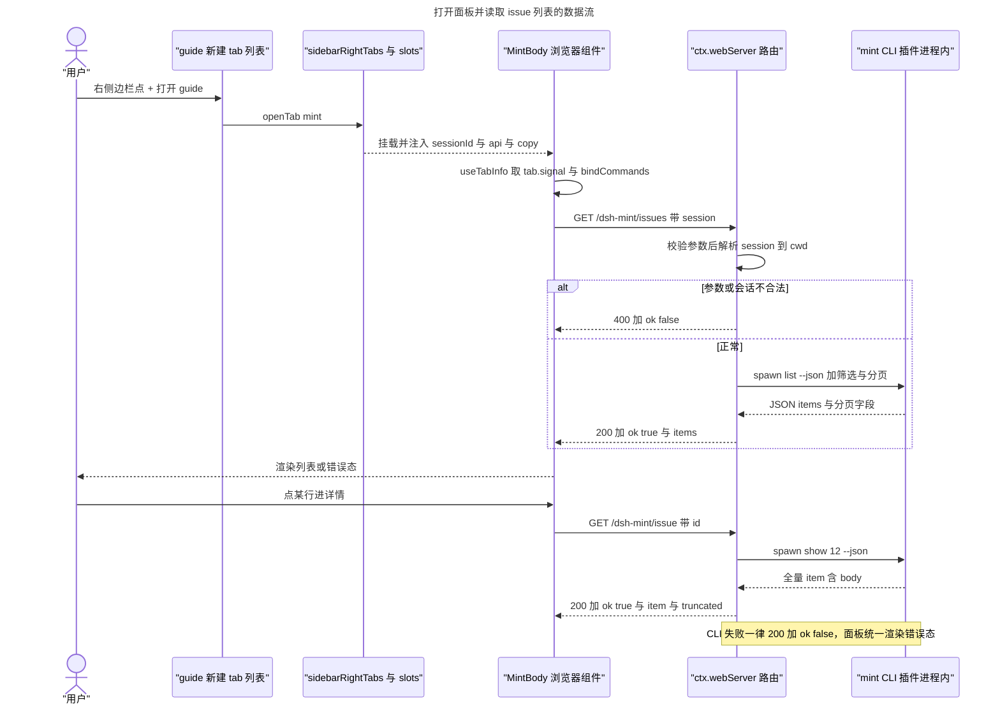

# 客户端面架构：通信机制与数据流向

> 本文件回答「**它由什么组成、谁拥有什么状态、一次点击怎么走到 mint**」。
> 逐个 seat/字段的**契约细节**（注册参数、PLATFORM_MODULES 清单、locale 形式、坑位表）见
> [client-face.md](client-face.md)；本文件只写架构与数据流，两者不重复。
> 事实基线：DSH 0.2.0-rc.2 + 本仓 0.2.0（#9/#10/#11/#12/#79）。

## 1. 一句话架构

dsh-mint 客户端面 = **一个插件包的两个半边**：
宿主半边（`dist/index.js`，cordis 插件）注册**只读 HTTP 路由**并 spawn mint CLI；
浏览器半边（`dist/client.js`，loader 工厂）向右侧边栏**注册一个页面类型**并用 `fetch` 取数。
两个半边**不共享内存、不共享类型运行时**，只共享 `src/records.ts` 的**类型声明**（编译期擦除）。

**职责边界（刻意如此）**：

- 面板**只读**：argv 由白名单拼装，写操作没有路由可达（`READ_ONLY_SUBCOMMANDS`）。
- 项目由**会话**决定：浏览器只传 `session=<id>`，宿主用 `ctx.agents.get(id).session.header.cwd` 解析目录，
  浏览器给不了路径 —— 面板无法被指向任意数据库。
- 面板**不直读 mint db**：一律经 CLI（与宿主面同一约束）。

## 2. 构建期：一份源码，两个产物



要点：

- **宿主面不得依赖 client 构建**（硬约束）：tsup 与 esbuild 各打各的，`dist/client.js` 只在浏览器里跑。
- `dist/client.js` 必须**预构建**并随包发布：声明了 `dsh.client` 却没有产物 = 宿主激活期直接报
  `MissingClientBundleError`。
- 浏览器半边**只能** `require` 内核冻结的基线模块；其余必须写进 `dsh.client.external`。
- 新增/改动 `dsh.client` 声明要**重启 harness**（boot 图只在启动扫描时入图）；之后改 bundle
  只需重新构建 + 刷新页面。

## 3. 运行期：一次列表请求的完整路径



三条通道，只有一条是「网络」：

| 通道 | 方向 | 载体 | 用途 |
| --- | --- | --- | --- |
| slot 注册 | 插件 → 页面 | `ctx.sidebarRightTabs` / `ctx.slots` | 让 tab 类型与 body 出现在右侧边栏（**页面内调用，不过网**） |
| HTTP 路由 | 页面 → 宿主 | `fetch('/dsh-mint/*')` ↔ `ctx.webServer` | 取数（唯一跨进程通道） |
| locale / theme | 插件 → 页面 | `ctx.locale.register` / `--dsw-*` token | 文案与配色，宿主提供 |

**为什么不是别的通道**（结论记录，避免重走）：静态插件的 client 半边拿不到 Typert `remote`
（`dsh-api-remotes` 的能力集在构建期固定，仓外无法 join）；`harness.handle`/`host.call` 只属于
**动态 Cordis 包** runner。在产先例是 `ctx.webServer` 路由 + `fetch`（`dshmarket`）。

## 4. 数据流：形状与降级

```
mint CLI --json  →  宿主守卫（isIssueItem / isContainerDetail …）  →  路由 JSON  →  client api  →  LoadState  →  视图
                         │ 丢弃坏 item 并附 warning              │ 失败也走 200│ ok:false  │            │ loading/failed/ready
```

- **守卫在宿主侧**：mint 是子进程，字段漂移不会让 import 失败。凡是面板渲染的字段都逐项校验；
  不合法 item 被丢弃并附 `warnings`，面板把它显示出来，而不是假装「没有数据」。
- **失败即数据**：会话失效 / 参数非法 → 400 `{ok:false,error}`；CLI 失败 → 200 `{ok:false,error,stderr}`。
  浏览器侧 `createApi` 把非 JSON、非 2xx、网络异常都归一成同一个 `{ok:false}`，所以面板只有一种错误态。
- **分页**：`list --json` 自带 `page/page_size/pages/total`，不解析 stdout 页脚。
  `pageSize` 宿主侧钳制到 1–100。
- **截断**：`issue` 详情的 body 超过 256 KiB 时按 UTF-8 边界截断并置 `truncated`。

## 5. 状态归属

| 状态 | 归属 | 生命周期 |
| --- | --- | --- |
| 打开了哪些 tab、在哪个 pane、是否浮动、呈现模式 | 右侧边栏 layout store | 按 session 持久化到 localStorage（刷新仍在） |
| tab 记录与 `tab.signal` | 侧边栏 Tab 域 | tab 关闭或插件卸载时 abort |
| 当前视图（Issue/Plan/Milestone）、筛选、页码、选中的条目 | **MintBody 组件内 `useState`** | 组件卸载即丢；不落盘（0.2.0 刻意如此） |
| 一次读取的 loading/failed/ready | MintBody 组件内 | 每次输入变化重新请求（旧请求 abort） |
| 文案词典 | client locale 注册表 | 插件生命周期 |

推论：**刷新页面会回到 Issue 视图第一页**——列表筛选不做持久化；只有「打开了哪些 tab」是持久的。
`tab.signal` 从 `useTabInfo()` 一路传到 `fetch`，因此关闭 tab 会取消在途请求。

## 6. 信任与暴露面

- 路由**不带浏览器会话校验**：DSH 的 cookie 认证只罩住 `/api`；`webServer` 路由靠
  `Host`/`Origin` 信任（loopback 或 `--trusted-host` 白名单）过滤跨站请求。因此面板路由对
  **本机进程**是可读的（实测 `curl http://127.0.0.1:3081/dsh-mint/issues` 直接可用）。
- 因此我们把暴露面压到最小：**只读 argv 白名单** + `id` 必须数字 + 过滤值不得以 `-` 开头 +
  不接受浏览器给的路径。写操作没有路由，`delete/import/sync/export/tui` 也不在白名单里。
- 局域网暴露取决于前置反代（本机是 `/home/user/scripts/dsh/proxy.js`）；面板数据是**本项目 issue 元数据**，
  不含凭据。

## 7. 验证阶梯（按成本从低到高）

| 层 | 手段 | 能证明什么 |
| --- | --- | --- |
| 纯逻辑 | `pnpm test`（model / routes / api / copy） | 参数映射、守卫、状态映射、URL 拼接 |
| 产物契约 | `src/client-bundle.test.ts` | bundle 是合法 loader 工厂、只 require 基线模块 |
| 注册面 | `cordis_inspect_query` client `Slots.listSubTree` | tab 类型与 body 是否真的注册进了座位 |
| 端到端（宿主） | `curl http://127.0.0.1:<port>/dsh-mint/...` | 路由匹配、session→cwd、CLI、守卫、错误分支（**实测可用**） |
| 端到端（界面） | 人眼看 GUI | 渲染、主题、交互 —— **agent 侧没有浏览器控制，只能由人确认** |

## 8. 0.2.0 的已知边界（有意留白）

- 单一语言（简体中文），英文走占位词典；真正的双语属 0.3.0。
- 面板**不含写操作**（issue 状态迁移、plan close 等）。
- 没有快捷键/命令入口：只能从 guide 新建；`commandId` 留空。
- 视图状态不持久化；不跨项目查询（属 #55）。
- 组件无 DOM 测试环境（jsdom + RTL 属 0.3.0）。
